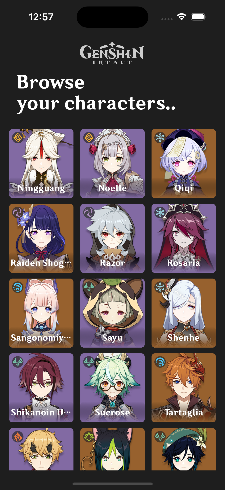
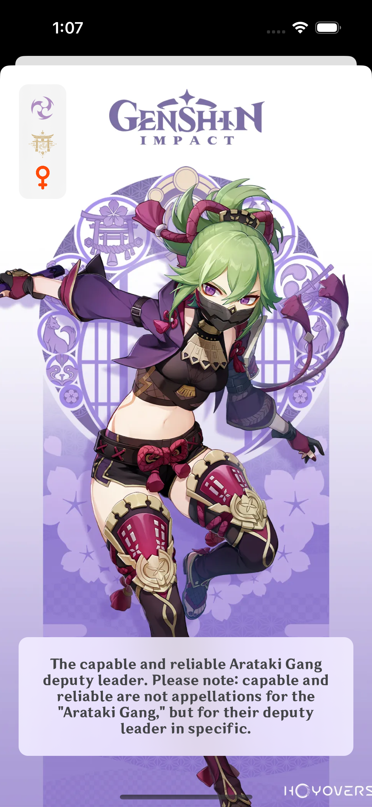

# Genshin Intact

Genshin Intact is a comprehensive guide app for Genshin Impact, designed for iOS devices. It empowers you to navigate the vibrant world of Teyvat with ease, optimize your gameplay, and stay updated on the latest developments. It supports light and dark modes.

## Screenshots

 | |
---------------------------|---------------------------|-------------------------
 | |

## Installation

Run `sudo gem install cocoapods`

Run `pod install`

Open the project from `.xcworkspace` file

## Technical Stack:

**RxSwift and RxCocoa**: Leverage reactive programming for responsive and fluid UI interactions.

**Promise Kit**: Handle asynchronous tasks efficiently with concise syntax.

**Programmatic UI**: Build dynamic and custom UIs for a tailored experience.

**Clean Architecture**: Maintain a well-organized codebase for improved maintainability and scalability.

**MVVM Pattern**: Separate business logic from presentation for clearer code and easier testing.

**Coordinator, Factory, Delegate Patterns, and more**: Utilize advanced design patterns for modularity and efficient communication between components.

## License

[MIT](https://choosealicense.com/licenses/mit/)

